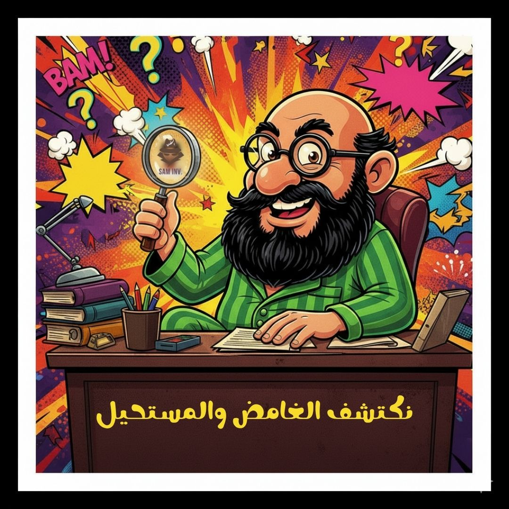

# ملف 001: كذبة الـ 10,000 جنيه (بدء التحقيق)

**ملخص القضية:** التحقيق جاري في كيانات تدعي أنها معاهد خاصة معتمدة وتتقاضى مبالغ طائلة.

## 🔑 الخيط الأول:
تم رصد إعلانات من "بروفيشنال" و "مسارك" توهم الطلاب بالاعتماد الأكاديمي. هذه الإعلانات تستغل غموض المصطلحات.

### 🔎 الأدلة المرصودة:

**1. غلاف القضية (صورة البرومو):**

**2. دليل التضليل اللغوي:**
تم تجميع الإعلانات التي تستخدم كلمة "معهد" بشكل خاطئ. الصورة توضح كيف يتم التلاعب بالمصطلحات.

### الخلاصة:
المفتاح الثاني سيُكشف قريباً!